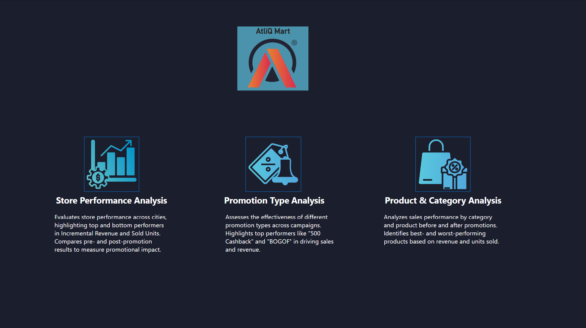
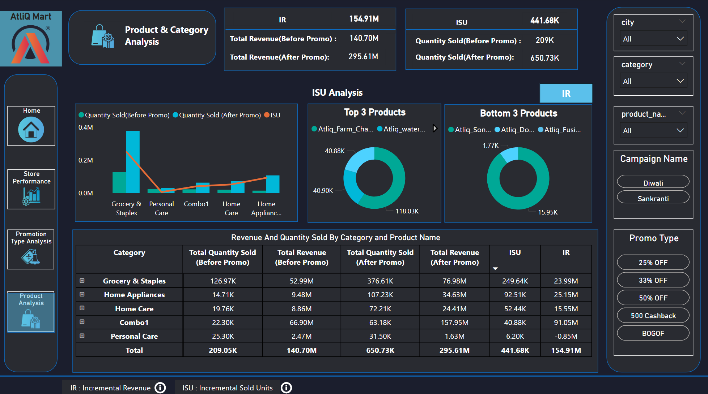
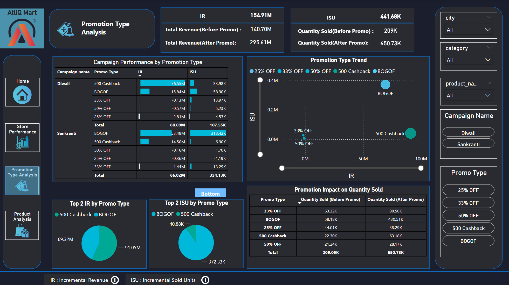
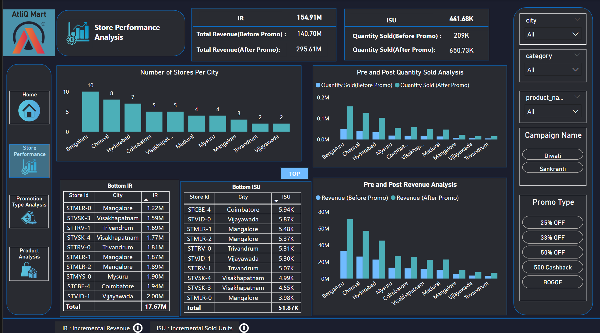

# 🛒 Promotion Sales Insights

This project provides a **comprehensive analysis of retail promotional campaigns** using SQL and Power BI.  
It uncovers **data-driven insights** into product performance, sales uplift, and campaign effectiveness, helping businesses make informed marketing and pricing decisions.  

Promotions analyzed include **BOGOF (Buy One Get One Free)**, **Cashback offers**, and **Percentage Discounts** — all evaluated for their impact on both **revenue** and **sales volume**.

---

## 📊 Project Overview

This project answers key business questions such as:
- Which **high-value products** are being heavily discounted?
- Which **cities** have the largest retail presence?
- How much **incremental revenue** did campaigns generate?
- Which categories performed best during the **Diwali festive promotion**?
- Which products ranked highest by **Incremental Revenue Percentage (IR%)**?

The findings are presented through **SQL-based analysis** and **interactive dashboards**, allowing for actionable decisions on promotions, inventory planning, and category focus.

---

## 🛠 Dataset & Tools
**Data Sources**
- **Fact Tables**: Transaction-level sales data (before and after promotion)
- **Dimension Tables**: Products, Stores, Campaigns

**Tech Stack**
- **SQL**: MySQL-compatible queries for data analysis  
- **Power BI**: Dashboard creation and visualization  
- **Excel/CSV**: Data pre-processing and validation

**Key Features**
- Multi-promotion type handling (`BOGOF`, `Cashback`, `Percentage Discounts`)
- Incremental performance metrics (`ISU%`, `IR%`)
- Campaign impact comparison

---

## 📜 SQL Scripts

### 1. 📈 **High-Value BOGOF Products**  
**File**: [`Ad_Hoc_Request1.sql`](Ad_Hoc_Request1.sql)  
Finds products with **Base Price > 500** that were part of **Buy One Get One Free** promotions.  
Helps identify premium items being aggressively promoted.

### 2. 🏬 **City-wise Store Distribution**  
**File**: [`Ad_Hoc_Request2.sql`](Ad_Hoc_Request2.sql)  
Lists cities with their **store counts**, sorted to highlight markets with the highest presence.

### 3. 💰 **Campaign Revenue Impact**  
**File**: [`Ad_Hoc_Request3.sql`](Ad_Hoc_Request3.sql)  
Calculates **total revenue before and after promotions** for each campaign, expressed in millions.

### 4. 🎯 **Diwali Campaign ISU% Ranking**  
**File**: [`Ad_Hoc_Request4.sql`](Ad_Hoc_Request4.sql)  
Ranks product categories by **Incremental Sold Quantity Percentage** during the Diwali festival.

### 5. 🏆 **Top Products by IR%**  
**File**: [`Ad_Hoc_Request5.sql`](Ad_hoc_Request5.sql)  
Lists the **top 5 products** with the highest **Incremental Revenue Percentage** across all campaigns.

---

## 📷 Dashboards

---

### **1. Promotion Sales Insights - Overview**  
  
A high-level summary of **overall sales**, promotional activity, and performance trends across the dataset.

---

### **2. Store & City Performance**  
  
Highlights **store distribution by city**, enabling identification of high-potential markets and areas for expansion.

---

### **4. Campaign Impact Analysis**  
  
Compares **total revenue before and after campaigns**, allowing stakeholders to assess **financial effectiveness** of promotions.

---

### **4. Category & Product Trends**  
  
Shows **category-wise** and **product-level** performance metrics, spotlighting top performers and underperformers for targeted improvement.

---

---

## 🗂 Project Workflow

flowchart TD
    A[📦 Data Source] --> B[🗄 SQL Queries]
    B --> C[📊 Processed Tables]
    C --> D[📈 Power BI Dashboards]
    D --> E[📝 Insights & Recommendations]
---

## 🚀 Key Insights
- **High-value BOGOF products** contributed strongly to incremental revenue.  
- A small number of **cities dominate store presence**, influencing reach and campaign performance.  
- **Festive campaigns** (e.g., Diwali) generated significant boosts for specific categories.  
- **Top IR% products** highlight items with the most successful promotional strategies.
